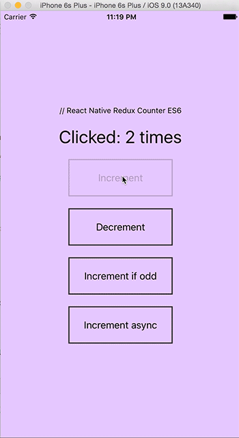

# Redux Counter Example w/ React Native + ES2015


- [React Native](https://facebook.github.io/react-native/) 0.18.1
- [Redux](https://github.com/rackt/redux) (v.3.0.5)
- [React Redux](https://github.com/rackt/react-redux) (v.4.0.6)
- [Original Redux Counter example](https://github.com/rackt/redux/tree/master/examples/counter)
- [ES2015](http://www.ecma-international.org/ecma-262/6.0/)



Note: If you have any trouble to build this app and got an error something like

```
Error building DependencyGraph: Error: Naming collision detected:
...
./node_modules/react/node_modules/fbjs/lib/warning.js collides with ./node_modules/react-native/node_modules/fbjs/lib/warning.js
    at HasteMap._updateHasteMap (HasteMap.js:132:13)
```
run `npm clean clean-dependency` and build again. This will remove duplicated
modules of `fbjs`. Thanks to [alin](https://github.com/alinz) for mentioning this
solution at [Update React Native installation instructions](https://github.com/rackt/react-redux/issues/236)

Just for fun - have fun :)

-Jens
